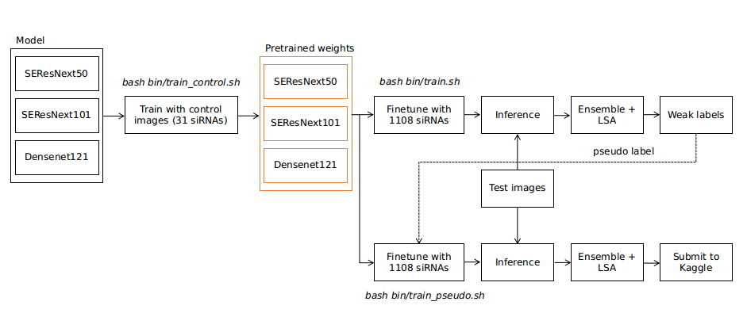

# Overview 
This repository is used for Recursion Cellular Image Classification.  
The writeup can be found in [here](https://www.kaggle.com/c/recursion-cellular-image-classification/discussion/110337)

The pipeline of this repository is shown as bellows



There are 3 main parts: 
* I. Pretrained from control images which has 31 siRNAs
* II. Continue fintuning models with image dataset which has 1108 siRNAs. 
* III. Continue fintuning models with image dataset and pseudo labels. 


# Getting started 
Thing you should know about the project. 
* We run experiments via bash files which are located in `bin` folder. 
* The config files (`yml`) are located in `configs` folder which are corresponding to each `bash files`. 

  Ex: `train_control.sh` should go with `config_control.yml` 

* The yml config file allows changing either via bash scripts for the flexible settings or directly modification for 
the fixed settings.  
  Ex: `stages/data_params/train_csv` can be `./csv/train_0.csv, ./csv/train_2.csv,... etc`. So when training K-Fold we
  make a for loop for the convinent. 
  
# Common settings 

The common settings in `yml config file`. 

1. Define the model
```yml 
model_params:
  model: cell_senet
  n_channels: 5
  num_classes: 1108
  model_name: "se_resnext50_32x4d"
```

* model: Model function (callable) which returns model for the training. It can be found in `src/models/` package. 
All the settings bellow `model_params/model` are considered as `parameters` of the function.  
  Ex: `cell_senet` has default paramters as `model_name='se_resnext50_32x4d', num_classes=1108, n_channels=6, weight=None`. 
  Those parameters can be set/overried as the config above. 
  
2. Metric monitoring  
  We use MAP@3 for monitoring. 
    ```
    state_params:
      main_metric: &reduce_metric accuracy03
      minimize_metric: False
    ```
3. Loss   
  `LabelSmoothingCrossEntropy` is used.
    ```
    criterion_params:
      criterion: LabelSmoothingCrossEntropy
    ```
4. Data settings 
    ```
      batch_size: 64
      num_workers: 8
      drop_last: False

      image_size: &image_size 512
      train_csv: "./csv/train_0.csv"
      valid_csv: "./csv/valid_0.csv"
      dataset: "non_pseudo"
      root: "/data/"
      sites: [1]
      channels: [1,2,3,4,5,6]
    ```

  * train_csv: path to train csv.
  * valid_csv: path to valid csv.
  * dataset: can be `control, non_pseudo, pseudo`. `control` is used to train with `control images` (Part I), `non_pseudo` is used to train non-pseudo dataset (Part II) and `pseudo` is used to train pseudo dataset (Part III). 
  * root: path to data root. Default is: `/data`
  * channels: a list of combination channels. Ex: [1,2,3], [4,5,6], etc.

5. Optimizer and Learning rate 
    ```
      optimizer_params:
        optimizer: Nadam
        lr: 0.001
    ```

6. Scheduler 

    OneCycleLR.

    ```
    scheduler_params:
      scheduler: OneCycleLR
      num_steps: &num_epochs 40
      lr_range: [0.0005, 0.00001]
      warmup_steps: 5
      momentum_range: [0.85, 0.95]
    ```

# Build docker 
```bash
cd docker 
docker build . -t ngxbac/pytorch_cv:kaggle_cell
```

# Run container
In `Makefile`, change: 
* `DATA_DIR`: path to the data from kaggle. 
```bash
|-- pixel_stats.csv
|-- pixel_stats.csv.zip
|-- recursion_dataset_license.pdf
|-- sample_submission.csv
|-- test
|-- test.csv
|-- test.zip
|-- test_controls.csv
|-- train
|-- train.csv
|-- train.csv.zip
|-- train.zip
`-- train_controls.csv
```

* `OUT_DIR`: path to the folder which contains log, checkpoints.

Run the commands: 

```bash
make run 
make exec 
cd /kaggle-cell/
```

# Part I. Train with from control images 

```bash
bash bin/train_control.sh
``` 

This part, we use all the control images from train and test. 

* Input: 
  * `model_name`: name of model.  
  In our solution, we train:  
    * se_resnext50_32x4d, se_resnext101_32x4d for `cell_senet`.
    * densenet121 for `cell_densenet`.

* Output: 
Default output folder is: `/logs/pretrained_controls/` where stores the models trained by control images. 
Here is an example we train `se_resnext50_32x4d` with 6 combinations of channels.
```bash
/logs/pretrained_controls/
|-- [1,2,3,4,5]
|   `-- se_resnext50_32x4d
|-- [1,2,3,4,6]
|   `-- se_resnext50_32x4d
|-- [1,2,3,5,6]
|   `-- se_resnext50_32x4d
|-- [1,2,4,5,6]
|   `-- se_resnext50_32x4d
|-- [1,3,4,5,6]
|   `-- se_resnext50_32x4d
`-- [2,3,4,5,6]
    `-- se_resnext50_32x4d
```

# Part II. Finetuning without pseudo label  
```bash
bash bin/train.sh
``` 
* Input:
  * `PRETRAINED_CONTROL`: The folder where stores the model trained with control images. Default: `/logs/pretrained_controls/` 
  *  `model_name`: name of model.  
  * `TRAIN_CSV/VALID_CSV`: train and valid csv file for each fold. They are automaticaly changed each fold.

* Output:  
  Default output folder is: `/logs/non_pseudo/`. Here is an example we train K-Fold `se_resnext50_32x4d` with 6 combinations of channels.

  ```
  /logs/non_pseudo/
  |-- [1,2,3,4,5]
  |   |-- fold_0
  |   |   `-- se_resnext50_32x4d
  |   |-- fold_1
  |   |   `-- se_resnext50_32x4d
  |   |-- fold_2
  |   |   `-- se_resnext50_32x4d
  |   |-- fold_3
  |   |   `-- se_resnext50_32x4d
  |   `-- fold_4
  |       `-- se_resnext50_32x4d
  |-- [1,2,3,4,6]
  |   |-- fold_0
  |   |   `-- se_resnext50_32x4d
  |   |-- fold_1
  |   |   `-- se_resnext50_32x4d
  |   |-- fold_2
  |   |   `-- se_resnext50_32x4d
  |   |-- fold_3
  |   |   `-- se_resnext50_32x4d
  |   `-- fold_4
  |       `-- se_resnext50_32x4d
  |-- [1,2,3,5,6]
  |   |-- fold_0
  |   |   `-- se_resnext50_32x4d
  |   |-- fold_1
  |   |   `-- se_resnext50_32x4d
  |   |-- fold_2
  |   |   `-- se_resnext50_32x4d
  |   |-- fold_3
  |   |   `-- se_resnext50_32x4d
  |   `-- fold_4
  |       `-- se_resnext50_32x4d
  |-- [1,2,4,5,6]
  |   |-- fold_0
  |   |   `-- se_resnext50_32x4d
  |   |-- fold_1
  |   |   `-- se_resnext50_32x4d
  |   |-- fold_2
  |   |   `-- se_resnext50_32x4d
  |   |-- fold_3
  |   |   `-- se_resnext50_32x4d
  |   `-- fold_4
  |       `-- se_resnext50_32x4d
  |-- [1,3,4,5,6]
  |   |-- fold_0
  |   |   `-- se_resnext50_32x4d
  |   |-- fold_1
  |   |   `-- se_resnext50_32x4d
  |   |-- fold_2
  |   |   `-- se_resnext50_32x4d
  |   |-- fold_3
  |   |   `-- se_resnext50_32x4d
  |   `-- fold_4
  |       `-- se_resnext50_32x4d
  `-- [2,3,4,5,6]
      |-- fold_0
      |   `-- se_resnext50_32x4d
      |-- fold_1
      |   `-- se_resnext50_32x4d
      |-- fold_2
      |   `-- se_resnext50_32x4d
      |-- fold_3
      |   `-- se_resnext50_32x4d
      `-- fold_4
          `-- se_resnext50_32x4d
  ``` 

# Part III. Finetuning pseudo labels

The different between Part III and Part II is only train/valid csv input files. 

```bash
bash bin/train_pseudo.sh
``` 
* Input:
  * `PRETRAINED_CONTROL`: The folder where stores the model trained with control images. Default: `/logs/pretrained_controls/` 
  *  `model_name`: name of model.  
  * `TRAIN_CSV/VALID_CSV`: train and valid csv file for each fold. They are automaticaly changed each fold.

* Output:  
  Default output folder is: `/logs/pseudo/`. Here is an example we train K-Fold `se_resnext50_32x4d` with 6 combinations of channels.

  ```
  /logs/pseudo/
  |-- [1,2,3,4,5]
  |   |-- fold_0
  |   |   `-- se_resnext50_32x4d
  |   |-- fold_1
  |   |   `-- se_resnext50_32x4d
  |   |-- fold_2
  |   |   `-- se_resnext50_32x4d
  |   |-- fold_3
  |   |   `-- se_resnext50_32x4d
  |   `-- fold_4
  |       `-- se_resnext50_32x4d
  |-- [1,2,3,4,6]
  |   |-- fold_0
  |   |   `-- se_resnext50_32x4d
  |   |-- fold_1
  |   |   `-- se_resnext50_32x4d
  |   |-- fold_2
  |   |   `-- se_resnext50_32x4d
  |   |-- fold_3
  |   |   `-- se_resnext50_32x4d
  |   `-- fold_4
  |       `-- se_resnext50_32x4d
  |-- [1,2,3,5,6]
  |   |-- fold_0
  |   |   `-- se_resnext50_32x4d
  |   |-- fold_1
  |   |   `-- se_resnext50_32x4d
  |   |-- fold_2
  |   |   `-- se_resnext50_32x4d
  |   |-- fold_3
  |   |   `-- se_resnext50_32x4d
  |   `-- fold_4
  |       `-- se_resnext50_32x4d
  |-- [1,2,4,5,6]
  |   |-- fold_0
  |   |   `-- se_resnext50_32x4d
  |   |-- fold_1
  |   |   `-- se_resnext50_32x4d
  |   |-- fold_2
  |   |   `-- se_resnext50_32x4d
  |   |-- fold_3
  |   |   `-- se_resnext50_32x4d
  |   `-- fold_4
  |       `-- se_resnext50_32x4d
  |-- [1,3,4,5,6]
  |   |-- fold_0
  |   |   `-- se_resnext50_32x4d
  |   |-- fold_1
  |   |   `-- se_resnext50_32x4d
  |   |-- fold_2
  |   |   `-- se_resnext50_32x4d
  |   |-- fold_3
  |   |   `-- se_resnext50_32x4d
  |   `-- fold_4
  |       `-- se_resnext50_32x4d
  `-- [2,3,4,5,6]
      |-- fold_0
      |   `-- se_resnext50_32x4d
      |-- fold_1
      |   `-- se_resnext50_32x4d
      |-- fold_2
      |   `-- se_resnext50_32x4d
      |-- fold_3
      |   `-- se_resnext50_32x4d
      `-- fold_4
          `-- se_resnext50_32x4d
  ``` 

# Predict

```bash
export LC_ALL=C.UTF-8
export LANG=C.UTF-8

CUDA_VISIBLE_DEVICES=2,3 python src/inference.py predict-all --data_root=/data/ --model_root=/logs/pseudo/ --model_name=se_resnext50_32x4d --out_dir /predictions/pseudo/
``` 
Where: 
* `data_root`: path to the data from kaggle. 
* `model_root`: path to the log folders (Ex: `/logs/pseudo/`, `/log/non_pseudo/`) 
* `model_name`: can be `se_resnext50_32x4d`, `se_resnext101_32x4d` or `densenet121`.
* `out_dir`: folder where stores the logit files. 

The `out_dir` will have the structure as follows: 
```
/predictions/pseudo/
|-- [1,2,3,4,5]
|   |-- fold_0
|   |   `-- se_resnext50_32x4d
|   |       `-- pred_test.npy
|   |-- fold_1
|   |   `-- se_resnext50_32x4d
|   |       `-- pred_test.npy
|   |-- fold_2
|   |   `-- se_resnext50_32x4d
|   |       `-- pred_test.npy
|   |-- fold_3
|   |   `-- se_resnext50_32x4d
|   |       `-- pred_test.npy
|   `-- fold_4
|       `-- se_resnext50_32x4d
|           `-- pred_test.npy
|-- [1,2,3,4,6]
|   |-- fold_0
|   |   `-- se_resnext50_32x4d
|   |       `-- pred_test.npy
|   |-- fold_1
|   |   `-- se_resnext50_32x4d
|   |       `-- pred_test.npy
|   |-- fold_2
|   |   `-- se_resnext50_32x4d
|   |       `-- pred_test.npy
|   |-- fold_3
|   |   `-- se_resnext50_32x4d
|   |       `-- pred_test.npy
|   `-- fold_4
|       `-- se_resnext50_32x4d
|           `-- pred_test.npy
|-- [1,2,3,5,6]
|   |-- fold_0
|   |   `-- se_resnext50_32x4d
|   |       `-- pred_test.npy
|   |-- fold_1
|   |   `-- se_resnext50_32x4d
|   |       `-- pred_test.npy
|   |-- fold_2
|   |   `-- se_resnext50_32x4d
|   |       `-- pred_test.npy
|   |-- fold_3
|   |   `-- se_resnext50_32x4d
|   |       `-- pred_test.npy
|   `-- fold_4
|       `-- se_resnext50_32x4d
|           `-- pred_test.npy
|-- [1,2,4,5,6]
|   |-- fold_0
|   |   `-- se_resnext50_32x4d
|   |       `-- pred_test.npy
|   |-- fold_1
|   |   `-- se_resnext50_32x4d
|   |       `-- pred_test.npy
|   |-- fold_2
|   |   `-- se_resnext50_32x4d
|   |       `-- pred_test.npy
|   |-- fold_3
|   |   `-- se_resnext50_32x4d
|   |       `-- pred_test.npy
|   `-- fold_4
|       `-- se_resnext50_32x4d
|           `-- pred_test.npy
|-- [1,3,4,5,6]
|   |-- fold_0
|   |   `-- se_resnext50_32x4d
|   |       `-- pred_test.npy
|   |-- fold_1
|   |   `-- se_resnext50_32x4d
|   |       `-- pred_test.npy
|   |-- fold_2
|   |   `-- se_resnext50_32x4d
|   |       `-- pred_test.npy
|   |-- fold_3
|   |   `-- se_resnext50_32x4d
|   |       `-- pred_test.npy
|   `-- fold_4
|       `-- se_resnext50_32x4d
|           `-- pred_test.npy
`-- [2,3,4,5,6]
    |-- fold_0
    |   `-- se_resnext50_32x4d
    |       `-- pred_test.npy
    |-- fold_1
    |   `-- se_resnext50_32x4d
    |       `-- pred_test.npy
    |-- fold_2
    |   `-- se_resnext50_32x4d
    |       `-- pred_test.npy
    |-- fold_3
    |   `-- se_resnext50_32x4d
    |       `-- pred_test.npy
    `-- fold_4
        `-- se_resnext50_32x4d
            `-- pred_test.npy
```

# Ensemble 
